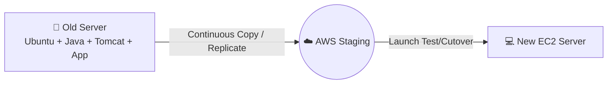
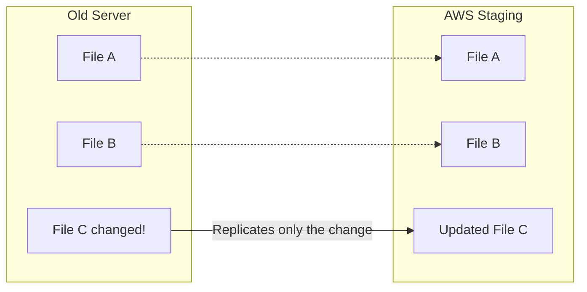
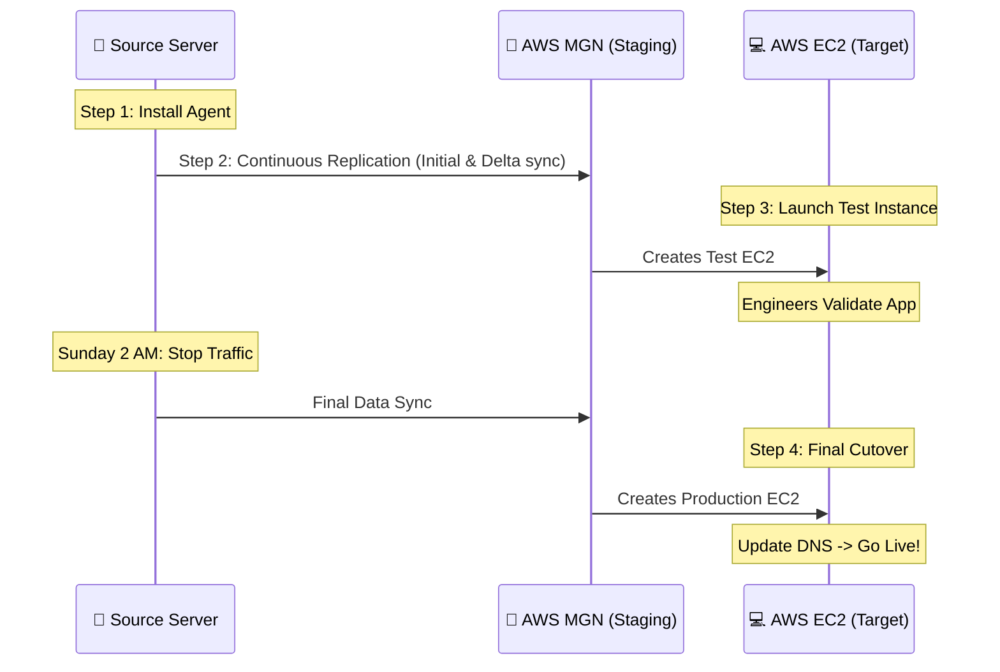

# 🚀 AWS Application Migration Service (MGN): The Ultimate Guide

> **AWS Application Migration Service (AWS MGN)** is an automated lift-and-shift migration service used to migrate physical, virtual, or cloud-based servers to AWS. It continuously replicates source servers into an AWS staging environment, allows you to launch test instances, and then perform a final cutover to production AWS instances with reduced downtime.

---

## 🧠 The Core Concept: Think of Only 2 Computers

Imagine you have an old Linux server sitting in your company's physical office:

**🏢 Old Company Server**
- **IP:** `192.168.1.10`
- **OS:** Ubuntu
- **Application:** Java
- **Web Server:** Tomcat
- **Files:** 100 GB

Your manager says: *"I want this entire server moved to AWS."*

You generally have two choices:

### ❌ Choice 1: The Manual Way (Slow & Error-Prone)
You create a new Amazon EC2 server and rebuild everything from scratch:
1. Create EC2
2. Install Ubuntu
3. Install Java
4. Install Tomcat
5. Copy application code
6. Copy all 100 GB of files
7. Configure everything

*This takes a lot of time, and human errors are almost guaranteed.*

### ✅ Choice 2: The AWS MGN Way (Fast & Automated)
AWS MGN essentially says: *"Give me your old server. I will continuously copy it into AWS. When you're ready, you can start the copied server as a new EC2 instance."*

---

## 🏦 Real-World Scenario: The Banking Project

Imagine your bank relies on an old physical data center. 

**🏢 Bank Data Center**
- **Server 1 IP:** `192.168.1.10`
- **OS:** Linux
- **App:** Java Banking Application
- **Customers:** Using it 24/7

**The Problem:** The physical servers are aging, and the bank wants to move to AWS. However, you *cannot* tell your customers, *"Please stop banking for 3 days while we copy our servers."* You need zero data loss and minimal downtime.

This is where **AWS MGN** shines.

### 📅 Day 1: You Start the Migration
Your old Linux server is still running perfectly, serving customers.

As a DevOps Engineer, you install a small **Replication Agent** on the old server. Think of this agent as a dedicated delivery person whose only job is to watch the server's disk and continuously send any changes securely to AWS.

### 📅 Day 2: The Initial Copy
MGN begins copying the 500 GB of data to an AWS Staging Area. 

*Crucially, customers are still using the old server without any interruption.* They can log in, transfer money, and check balances. The migration happens completely in the background.

### 📅 Day 3: Handling Live Changes
While the initial copy is happening (or even after it finishes), a customer transfers ₹10,000. 

The source server's disk changes. MGN detects this changed block and immediately sends *only the update* to AWS.

*This continuous synchronization is the magic of MGN.*

### 📅 Day 5: Launching a Test Server
Once replication is healthy, you don't just blindly switch over. You test!

In the AWS Console, you click **"Launch Test Instance"**. MGN spins up a brand new EC2 instance based on the replicated data.

Now you have two environments:
1. **Old Production Server:** Still serving real customers.
2. **AWS Test EC2:** A perfect clone for engineers to test.

Your team thoroughly validates the test server:
- ✅ SSH works?
- ✅ Java & Tomcat running?
- ✅ Application opens on Port 8080?
- ✅ Database connects?

### 📅 Day 7: The Final Cutover
Testing passed! Your manager approves the final migration for Sunday at 2:00 AM (the "cutover window").

**The Cutover Steps:**
1. **Stop Writes:** Temporarily stop traffic to the old application so no new data is written.
2. **Final Sync:** Allow MGN a few minutes to flush the very last changes to AWS.
3. **Launch Cutover Instance:** Tell MGN to launch the final production EC2 instance.
4. **Validate:** Do a quick sanity check.
5. **Switch Traffic:** Update your DNS to point to the new AWS EC2 server.

🎉 **Migration Complete!**

---

## 📌 The MGN Concept in One Picture

---

## 💡 The Easiest Way to Remember MGN

**AWS MGN = Move my existing server to AWS without rebuilding everything manually.**

Remember these four pillars:
1. **SOURCE** ➞ Your old server
2. **REPLICATE** ➞ Keep copying server disk changes to AWS in real-time
3. **TEST** ➞ Launch a test EC2 and validate without impacting production
4. **CUTOVER** ➞ Switch production traffic to AWS

> [!NOTE]
> **Technical Note:** MGN is fundamentally a server migration/rehosting tool. It is not just a backup tool, nor is it a simple `scp` file copy. Also, if your database is on a separate server, you might use specialized tools (like AWS DMS) alongside MGN for a coordinated migration strategy.
